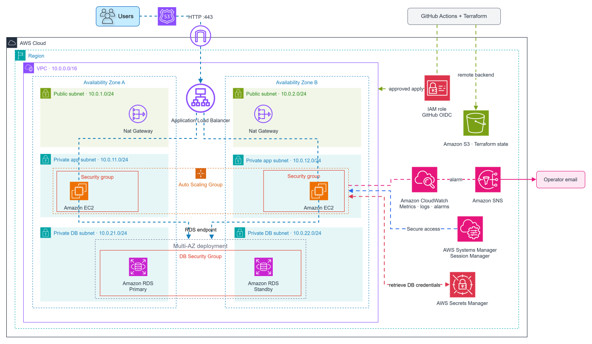

# Resilient Application Infrastructure

A highly available, elastic AWS web tier backed by secure, multi-tier infrastructure, provisioned with Terraform and operated through observability, automated recovery, and delivered through controlled CI/CD.

This project designs and implements resilient AWS application infrastructure that can be reproducibly deployed, securely administered, monitored, scaled, recovered from failures, and destroyed/rebuilt for cost control.

1. **Infrastructure / IaC** — Multi-AZ networking and compute, load balancing, Auto Scaling, private database infrastructure, IAM security, and Terraform.
2. **Operations & Observability** — Centralized logging, metrics, alarms, health checks, scaling behavior, failure injection, and recovery validation.
3. **Controlled Delivery** — GitHub Actions CI/CD, Terraform validation and planning, OIDC authentication, deployment approvals, and reproducible infrastructure lifecycle management.

---

**Target production architecture.** The portfolio implementation uses selected cost optimizations documented in DECISIONS.md.

- VPC spanning two Availability Zones
- Public subnets for the Application Load Balancer and NAT Gateways
- Private application subnets for EC2
- Private database subnets for Amazon RDS
- EC2 Auto Scaling Group across multiple Availability Zones
- Security-group-based tier isolation
- AWS Systems Manager Session Manager for administration
- Amazon CloudWatch metrics, logs, alarms, and operational testing
- Terraform infrastructure provisioning
- Amazon S3-backed remote Terraform state
- GitHub Actions CI/CD with AWS OIDC authentication
- Controlled infrastructure deployment with manual approval
- Cost-controlled destroy/rebuild workflow

## Engineering Goals

The project is designed to validate:

- Designing a segmented multi-tier AWS architecture
- Provisioning infrastructure reproducibly with Terraform
- Isolating application and database workloads from direct public access
- Maintaining and scaling compute capacity automatically
- Observing infrastructure and application behavior
- Troubleshooting failures and verifying recovery
- Reasoning about resilience, security, cost, and production tradeoffs
- Delivering infrastructure changes through a controlled CI/CD process
- Destroying and reproducibly rebuilding the environment
