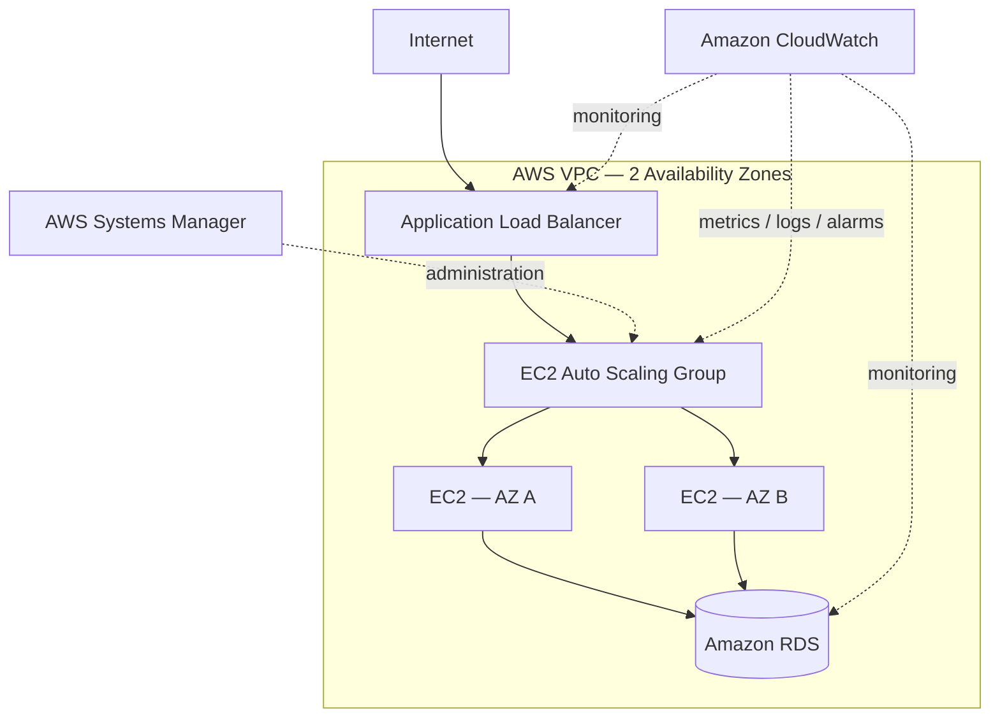

# Resilient Application Infrastructure Engineering on AWS

A multi-AZ AWS application environment provisioned with Terraform, operated with observability and failure testing, and delivered through controlled CI/CD.

## Overview

This project designs and implements a resilient AWS application infrastructure that can be reproducibly deployed, securely administered, observed, failure-tested, scaled, and destroyed/rebuilt for cost control.

The system is developed across three engineering layers:

1. **Infrastructure / IaC** — networking, compute, database, security, and Terraform
2. **Operations & Observability** — monitoring, logging, alarms, scaling, failure testing, and recovery
3. **Controlled Delivery** — GitHub Actions (CI/CD), Terraform validation/planning, OIDC authentication, approval gates, and reproducible deployment

## Architecture

- VPC spanning two Availability Zones
- Public subnets for the Application Load Balancer and NAT
- Private application subnets for EC2
- Private database subnets for Amazon RDS
- EC2 Auto Scaling Group across multiple Availability Zones
- Security-group-based tier isolation
- AWS Systems Manager Session Manager for administration
- Amazon CloudWatch metrics, logs, alarms, and operational testing
- Terraform infrastructure provisioning
- Amazon S3-backed remote Terraform state
- GitHub Actions CI/CD with AWS OIDC authentication
- Controlled infrastructure deployment with manual approval
- Cost-controlled destroy/rebuild workflow

## Engineering Goals

The project is designed to validate:

- Designing a segmented multi-tier AWS architecture
- Provisioning infrastructure reproducibly with Terraform
- Isolating application and database workloads from direct public access
- Maintaining and scaling compute capacity automatically
- Observing infrastructure and application behavior
- Deliberately introducing failures and verifying recovery
- Reasoning about resilience, security, cost, and production tradeoffs
- Delivering infrastructure changes through a controlled CI/CD process
- Destroying and reproducibly rebuilding the environment
